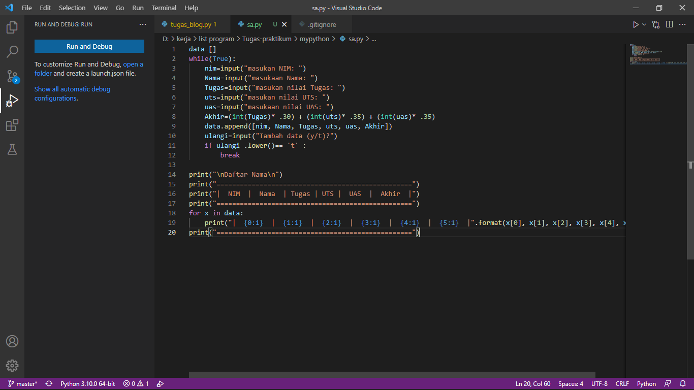
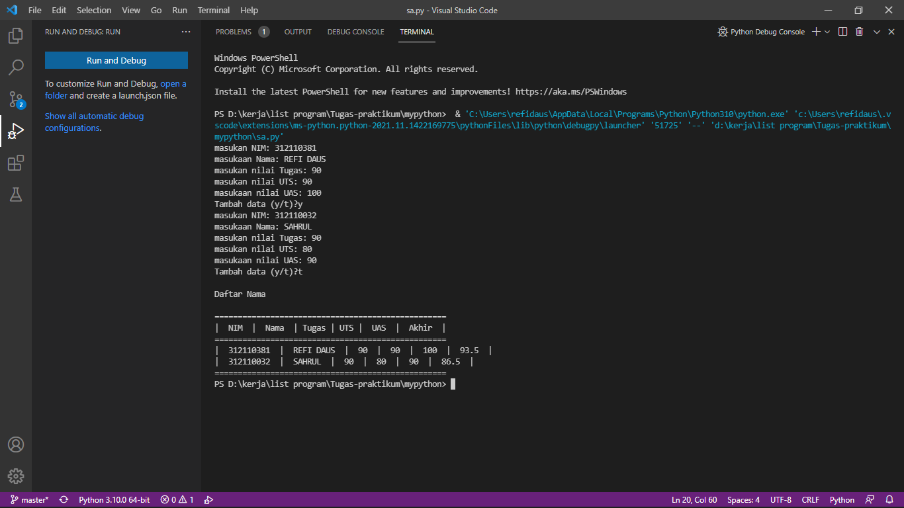

 <p>
### Program ini adalah program untuk Menghitung dan Menampilkan data nilai Mahasiswa dengan menggunakan LIST  penjelasan tentang program untuk menghitung dan menampilkan data mahasiswa dan nilai yg di dapat, dengan perhitungan nilai (tugas : 30%, uts : 35%, uas: 35%). 


## Entry Input Pada Program Ini Adalah : 
<ul>
   <li>Input <b>Nama</b> </li>
   <li>Input <b>Nim</b></li>
   <li>Input <b>NILAI Tugas</b></li>
   <li>Input <b>Nilai Uas</b></li>
   <li>Input <b>Nilai Akhir</b></li>
</ul>
<hr/>


### Disini saya juga menggunakan fungsi list untuk program input pada koding ini, yaitu menggunakan Visual Studi Code. 
### selain itu saya menggunakan perintah while untuk mengulang pertanyaan yang akan diinput 

```javascript
data=[]
while(True):
    nim=input("masukan NIM: ")
    Nama=input("masukaan Nama: ")
    Tugas=input("masukan nilai Tugas: ")
    uts=input("masukan nilai UTS: ")
    uas=input("masukaan nilai UAS: ")
```

### Maka outputnya akan ada pertanyaan tambah data jika jawab "y" maka pertanyaan akan terulang kembali dan diiput kembali seperti sebelumnya, jika menjawab "t" maka perintah selesai dan keluar output hasil inputan. dengan cara itu kita bisa menginput lebih dari 1 inputan atau sesuai yg kita inginkan.
```javascript
Akhir=(int(Tugas)* .30) + (int(uts)* .35) + (int(uas)* .35)
    data.append([nim, Nama, Tugas, uts, uas, Akhir])
    ulangi=input("Tambah data (y/t)?")
```
## PERINTAH 
```javascript
if ulangi .lower()== 't' :
        break
```
## Untuk menambahkan baris pada tabel. untuk menampilkan karakter bisa ditambahkan tanda (' ') dan untuk menampilkan hasil dari input tidak menggunakan tanda petik. dan untuk perhitungan nilai akhir menggunakan operator aritmatika perkalian dan penjumlahan.
```javascript
print("\nDaftar Nama\n")
print("==================================================")
print("|  NIM  |  Nama  | Tugas | UTS |  UAS  |  Akhir  |")
print("==================================================")
for x in data:
    print("|  {0:1}  |  {1:1}  |  {2:1}  |  {3:1}  |  {4:1}  |  {5:1}  |".format(x[0], x[1], x[2], x[3], x[4], x[5]))
print("==================================================")
```


### HASIL INPUT :
 <p>
### HASIL OUTPUT :
 <p>